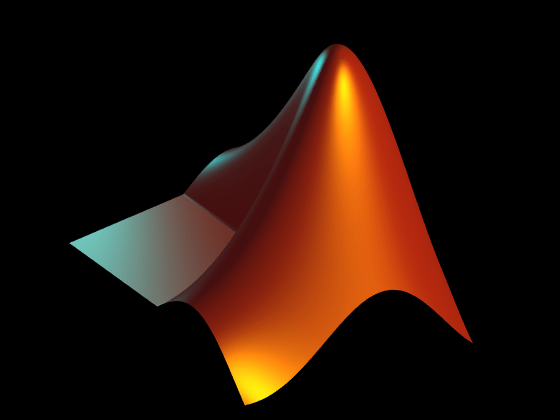

# Jkutkut's projects
Here you will see the variety of projects you can find here.

<!--  -->

    

[JavaScript](https://github.com/Jkutkut/JavaScript)

    

## [Python](https://github.com/Jkutkut/Python)

    

## [Java](https://github.com/Jkutkut/Java)

    

## [Shell Script](https://github.com/Jkutkut/Shell-Script)

    

## [Regex](https://github.com/Jkutkut/Regex)

    

## [3D Design](https://github.com/Jkutkut/3D_Design)

    

## [Android Studio]()

    

## [AppInventor](https://github.com/Jkutkut/AppInventor)

    

## [Arduino](https://github.com/Jkutkut/Arduino)

    

## [Google Sheets](https://github.com/Jkutkut/Google-Sheets)

    

## [MatLab]()

    

## [Geogebra](https://github.com/Jkutkut/Geogebra)

    

## [Scratch](https://github.com/Jkutkut/Scratch)

<!-- ## [Automagic](https://github.com/Jkutkut/Automagic) -->

 
 

### Special thanks:
- JS logo: <a href="https://www.flaticon.com/authors/roman-kacerek" title="Roman Káčerek">Roman Káčerek</a>
- Python logo: <a href="https://www.freepik.com" title="Freepik">Freepik</a>
- Java logo: <a href="https://www.flaticon.com/authors/riajulislam" title="riajulislam">riajulislam</a>
- Cad logo: <a href="https://www.flaticon.com/authors/uniconlabs" title="Uniconlabs">Uniconlabs</a>
- AppInventor logo: <a href="https://www.flaticon.com/authors/eucalyp" title="Eucalyp">Eucalyp</a>
- Scratch logo: <a href="https://www.freepik.com" title="Freepik">Freepik</a>