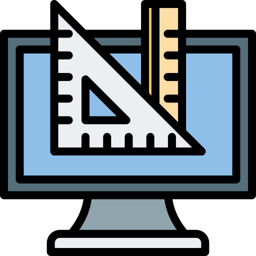

# Jkutkut's projects
Here you will see the variety of projects you can find here.

||Type|
|---|---|
||<h2>[JavaScript](./js/javascript.en.md)<h2>|
||<h2>[Python](./python/python.en.md)<h2>|
||<h2>[Java](./java/java.en.md)<h2>|
||<h2>[Shell Script](./shell-script/shell-script.en.md)<h2>|
||<h2>[Regex](https://github.com/Jkutkut/Regex)<h2>|
||<h2>[3D Design](./cad/cad.en.md)<h2>|
||<h2>[Android Studio](./app/android/android-studio.en.md)<h2>|
||<h2>[AppInventor](./app/app-inventor/app-inventor.en.md)<h2>|

||<h2>[Arduino](https://github.com/Jkutkut/Arduino)<h2>|
||<h2>[Google Sheets](https://github.com/Jkutkut/Google-Sheets)<h2>|
||<h2>[MatLab]()<h2>|
||<h2>[Geogebra](https://github.com/Jkutkut/Geogebra)<h2>|
||<h2>[Scratch](https://github.com/Jkutkut/Scratch)<h2>|
<!-- ||<h2>[Automagic](https://github.com/Jkutkut/Automagic)<h2>| -->

 
 

#Special thanks:
- JS logo: <a href="https://www.flaticon.com/authors/roman-kacerek" title="Roman Káčerek">Roman Káčerek</a>
- Python logo: <a href="https://www.freepik.com" title="Freepik">Freepik</a>
- Java logo: <a href="https://www.flaticon.com/authors/riajulislam" title="riajulislam">riajulislam</a>
- Cad logo: <a href="https://www.flaticon.com/authors/uniconlabs" title="Uniconlabs">Uniconlabs</a>
- AppInventor logo: <a href="https://www.flaticon.com/authors/eucalyp" title="Eucalyp">Eucalyp</a>
- Scratch logo: <a href="https://www.freepik.com" title="Freepik">Freepik</a>